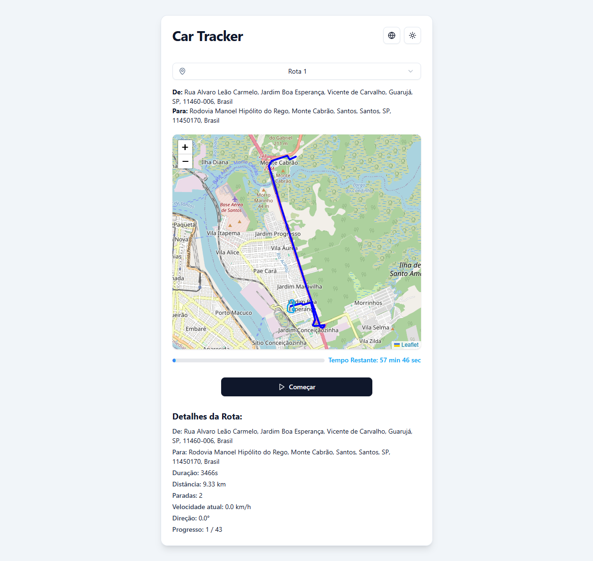
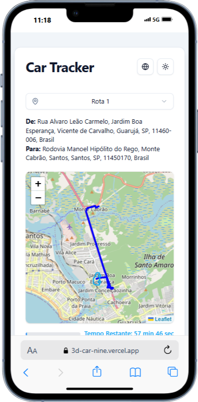
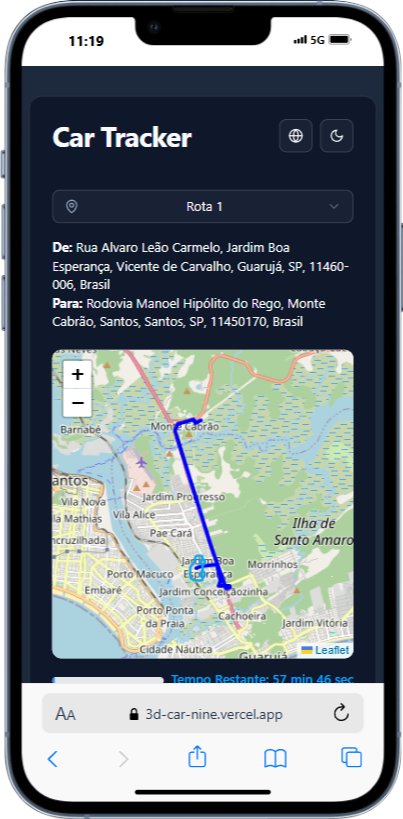

# GPS Car Tracker

Este projeto renderiza uma animação de um veículo em um mapa utilizando dados de GPS. A aplicação permite ao usuário selecionar diferentes trajetos, visualizar o progresso da animação e obter detalhes sobre a rota, como distância, duração e velocidade.

## 💻 Demo

- Veja a aplicação funcionando aqui: [https://3d-car-nine.vercel.app/](https://3d-car-nine.vercel.app/)

## 📸 Screenshots

<p  align="center">
  <h5 align="center">🖥 Desktop:</h5>
  <kbd>

</kbd>
  <kbd>

</kbd>
</p>
  <h5 align="center">📱 Mobile:</h5>
<p  align="center">
<kbd>

</kbd>
<kbd>

</kbd>
</p>

## ✨ Funcionalidades

-   **Visualização no Mapa:** Exibe um mapa interativo com o trajeto do veículo desenhado.
-   **Animação do Veículo:** Um ícone de carro se move ao longo da rota, com sua rotação ajustada para indicar a direção do movimento.
-   **Animação Baseada na Velocidade:** A velocidade da animação no mapa é ajustada com base nos dados de velocidade do veículo para cada ponto do trajeto.
-   **Seleção de Rotas:** O usuário pode escolher entre diferentes trajetos disponíveis nos dados de GPS.
-   **Controles de Animação:** Botões para iniciar e reiniciar a animação.
-   **Internacionalização:** Suporte para múltiplos idiomas (Português, Inglês e Espanhol).
-   **Tema Dinâmico (Dark/Light Mode):** O usuário pode alternar entre o tema claro e escuro.

## 🏛️ Arquitetura e Decisões Técnicas

-   **Gerenciamento de Estado Simplificado:** O estado da aplicação é gerenciado localmente no componente `App.tsx` com o hook `useState`. Esta abordagem foi escolhida por sua simplicidade e adequação à complexidade atual do projeto.

-   **Lógica de Animação com Hook Customizado:** A lógica de animação foi abstraída para um hook customizado `useCarAnimation`. Isso limpa o componente `App.tsx`, tornando-o mais declarativo, e isola a lógica de animação para fácil manutenção e teste.

-   **Otimização de Performance:** Componentes que não dependem do estado da animação (`RouteSelect`, `LanguageSwitcher`) foram otimizados com `React.memo` para prevenir re-renderizações desnecessárias, garantindo uma UI fluida.

-   **Testes Automatizados:** O projeto inclui testes unitários com **Vitest** e **React Testing Library** para validar a lógica de processamento de dados (`helpers`), o comportamento da animação (`hooks`) e a renderização dos componentes de UI, assegurando a qualidade e a estabilidade do código.

## 🧠 Lógica Principal da Animação

A lógica de animação do veículo é o coração do projeto e está encapsulada no hook customizado `useCarAnimation`:

-   **Estado Interno:** O hook gerencia os estados `carIndex` (a posição atual no array de pontos GPS) e `isPlaying` (se a animação está ativa).
-   **Controle com `useEffect`:** Um `useEffect` é responsável por criar e destruir os timers da animação. Ele é reativado sempre que `isPlaying` ou `carIndex` mudam.
    -   Dentro do hook, a velocidade do veículo no ponto atual é recuperada.
    -   Um `setTimeout` é utilizado para agendar a próxima atualização de `carIndex`. O intervalo do timeout é **dinâmico e inversamente proporcional à velocidade do carro**, o que cria o efeito de aceleração e desaceleração na animação.
    -   Quando a animação chega ao fim, o hook para de agendar novos timers.

## 🏗️ Estrutura do Projeto

O projeto foi organizado de forma modular para separar responsabilidades e facilitar a manutenção.

```
/src
├── api/
│   └── frontend_data_gps.json   # Dados brutos de GPS
├── components/
│   ├── ui/                      # Componentes base do Shadcn UI (Button, Card, etc.)
│   ├── ActionButton.tsx         # Botão de controle (Iniciar/Reiniciar)
│   ├── DetailsCard.tsx          # Card com detalhes da rota
│   ├── LanguageSwitcher.tsx     # Dropdown para troca de idioma
│   ├── Map.tsx                  # Componente que renderiza o mapa e a animação
│   ├── ModeToggle.tsx           # Botão para alternar tema (dark/light)
│   ├── ProgressBar.tsx          # Barra de progresso da animação
│   ├── RouteSelect.tsx          # Dropdown para seleção de rota
│   └── ThemeProvider.tsx        # Provedor de contexto para o tema
├── helpers/
│   └── gpsData.ts               # Lógica para processar os dados brutos de GPS
├── hooks/
│   └── useCarAnimation.ts       # Hook customizado com a lógica da animação
├── lib/
│   └── utils.ts                 # Função utilitária cn do Shadcn para mesclar classes
├── locales/
│   ├── en/common.json           # Textos em Inglês
│   ├── es/common.json           # Textos em Espanhol
│   └── pt/common.json           # Textos em Português
├── test/
│   └── setup.ts                 # Configuração global para os testes
├── App.tsx                      # Componente principal que gerencia o estado da aplicação
├── i18n.ts                      # Configuração do i18next
└── main.tsx                     # Ponto de entrada da aplicação
```

### Detalhes dos Componentes Principais

-   **`Map.tsx`**: Renderiza o mapa usando `react-leaflet`. É responsável por desenhar a polilinha da rota e o marcador do carro. O ícone do carro é um SVG customizado que recebe a direção do veículo e a aplica como uma rotação de CSS para que o ícone aponte para a direção correta do movimento.
-   **`RouteSelect.tsx`**: Um dropdown controlado que permite ao usuário selecionar uma das rotas processadas a partir dos dados de GPS. Ao mudar a rota, o estado no componente `App` é atualizado, reiniciando a animação.
-   **`DetailsCard.tsx`**: Exibe informações textuais e dinâmicas sobre o trajeto atual, como endereços, duração, distância, paradas, velocidade atual e progresso.
-   **`ActionButton.tsx`**: Um botão de ação cujo texto e cor mudam de acordo com o estado da animação (`Iniciar`, `A Caminho`, `Reiniciar`), oferecendo um feedback visual claro ao usuário.

## 🛠️ Tecnologias Utilizadas

A seleção de tecnologias visou criar uma aplicação moderna, performática e de fácil manutenção, seguindo as melhores práticas de desenvolvimento front-end.

-   **Vite:** Utilizado como build tool e servidor de desenvolvimento. Foi escolhido por sua extrema velocidade, proporcionada pelo hot module replacement (HMR) nativo e pelo uso de esbuild.
-   **React:** Biblioteca principal para a construção da interface de usuário. Sua abordagem baseada em componentes permite a criação de uma UI modular e reutilizável.
-   **TypeScript:** Adiciona tipagem estática ao JavaScript, o que aumenta a robustez do código, melhora o autocompletar e ajuda a prevenir bugs em tempo de desenvolvimento.
-   **Tailwind CSS:** Um framework CSS utility-first para estilização rápida e consistente sem a necessidade de escrever CSS customizado. Ele é configurado com a v4, que oferece performance aprimorada.
-   **Shadcn UI:** Uma coleção de componentes de UI reutilizáveis, construídos com Radix UI e Tailwind CSS. Foi utilizado para compor a interface de forma ágil com componentes acessíveis e customizáveis como `Card`, `Button` e `Select`.
-   **Leaflet & React-Leaflet:** Bibliotecas escolhidas para a renderização dos mapas. Leaflet é uma solução leve e poderosa para mapas interativos, e `react-leaflet` fornece bindings para integrá-lo de forma declarativa em aplicações React.
-   **Vitest & React Testing Library:** Para testes unitários e de componentes, garantindo a qualidade e a confiabilidade do código.
-   **i18next & react-i18next:** Utilizadas para a implementação da internacionalização (i18n), permitindo que o texto da aplicação seja traduzido facilmente para múltiplos idiomas.
-   **Lucide React:** Biblioteca de ícones escolhida por sua simplicidade, consistência e fácil customização.

## 📊 Modelagem dos Dados

Os dados brutos fornecidos no arquivo `frontend_data_gps.json` são processados pelo helper `src/helpers/gpsData.ts`. Esta função mapeia os "cursos" (trajetos) para uma estrutura de dados `Route` mais amigável para ser consumida pelos componentes React. Cada objeto `Route` contém informações prontas para uso, como:

-   `points`: Um array de coordenadas `[latitude, longitude]`.
-   `speeds`: Um array com as velocidades em cada ponto.
-   `directions`: Um array com as direções em cada ponto.
-   `startName` e `endName`: Endereços de início e fim da rota.
-   Outros metadados como `duration`, `distance` e `stops`.

Essa abordagem separa a lógica de transformação dos dados da lógica de apresentação, tornando os componentes mais limpos e focados em sua responsabilidade de renderização.

## 🚀 Como Executar o Projeto

Siga os passos abaixo para rodar a aplicação localmente:

1.  **Clone o repositório:**
    ```bash
    git clone [https://github.com/gmartins-dev/3d-car](https://github.com/gmartins-dev/3d-car)
    cd 3d-car
    ```

2.  **Instale as dependências:**
    O projeto utiliza `pnpm` como gerenciador de pacotes.
    ```bash
    pnpm install
    ```

3.  **Inicie o servidor de desenvolvimento:**
    ```bash
    pnpm dev
    ```

4.  **Execute os testes:**
    ```bash
    pnpm test
    ```
    Ou para a interface gráfica de testes:
    ```bash
    pnpm test:ui
    ```

5.  Abra o seu navegador e acesse `http://localhost:5173` (ou a porta indicada no seu terminal).

## 🔮 Melhorias Futuras

-   [ ] Implementar um modo "seguir o carro" no mapa, onde o centro do mapa se ajusta automaticamente à posição do veículo durante a animação.
-   [ ] Adicionar mais visualizações de dados, como um gráfico de velocidade vs. tempo, velocidade média etc...
-   [ ] Permitir a seleção de diferentes ícones para o veículo.
-   [ ] Otimizar a renderização de rotas muito longas.
